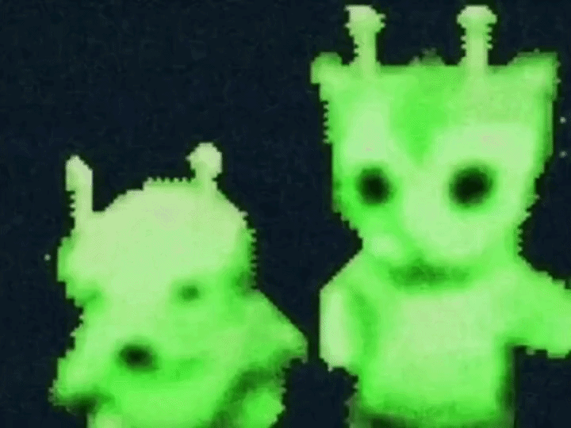

<div align="center" style="display: flex; align-items: center; justify-content: center; gap: 500px;">
  
  
</div>

<div align="center">
  
</div>

<br/>

---

### 🪐 About me

```txt
  Haryana, India
  student figuring things out one commit at a time
  building small projects to grow step by step
  currently exploring: Python + web stuff

```

---

### 🛠️ Tech i work with

<div align="left">


</div>

---

### 📊 GitHub stats

<div align="left" style="margin-top: 16px;">
  
</div>

---

### 🌐 Find me

<div align="left">

[](https://instagram.com/quasarsama)
[](https://linkedin.com/in/rahul-bharti0106)

<!-- [](mailto:rahul433108k@gmail.com) -->

</div>
